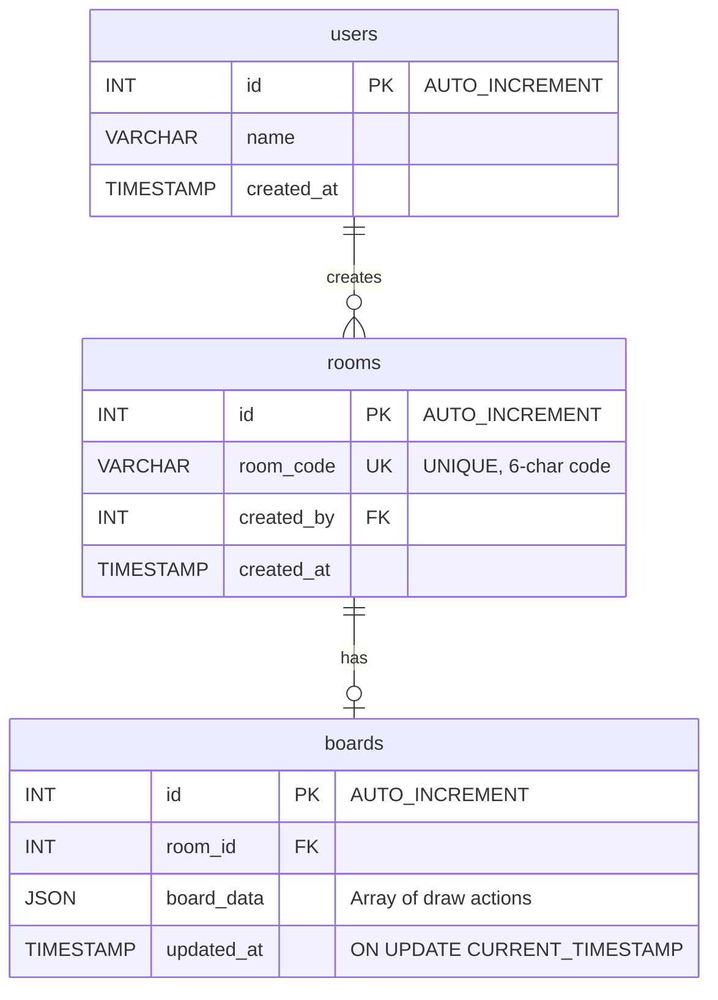

<p align="center">
  
  
  
  
  
</p>

<h1 align="center">🎨 CollabBoard</h1>

<p align="center">
  <strong>A real-time collaborative whiteboard with live cursors, role-based access control, and integrated chat — built from scratch.</strong>
</p>

<p align="center">
  <a href="#-architecture">Architecture</a> •
  <a href="#-features">Features</a> •
  <a href="#-tech-stack">Tech Stack</a> •
  <a href="#-getting-started">Getting Started</a> •
  <a href="#-project-structure">Project Structure</a> •
  <a href="#-socket-event-flow">Socket Event Flow</a> •
  <a href="#-database-schema">Database Schema</a>
</p>

---

## 🧠 Why This Project?

Most "collaborative" apps are just CRUD wrappers. **CollabBoard** is engineered around the hard problems of real-time systems:

- **Sub-frame latency** — Drawing strokes broadcast to all participants in <50ms via WebSocket
- **Conflict-free state** — In-memory board state replays every stroke for late joiners without conflicts
- **Presence awareness** — Live cursor tracking with intelligent visibility (show on draw → auto-hide after 2s idle)
- **Authorization at the socket layer** — Role-based drawing permissions enforced server-side, not just hidden in UI

This project demonstrates **event-driven architecture**, **real-time state synchronization**, and **clean separation of concerns** across a full-stack JavaScript application.

---

## 📐 Architecture

```
┌─────────────────────────────────────────────────────────────────────────┐
│                              CLIENT (React + Vite)                      │
│                                                                         │
│   ┌──────────┐   ┌──────────┐   ┌──────────┐   ┌──────────┐           │
│   │LoginPage │──▶│Dashboard │──▶│ RoomPage │   │ Private  │           │
│   │          │   │   Page   │   │          │   │  Route   │           │
│   └──────────┘   └──────────┘   └────┬─────┘   └──────────┘           │
│                                      │                                  │
│                    ┌─────────────────┼─────────────────┐               │
│                    ▼                 ▼                  ▼               │
│             ┌────────────┐   ┌────────────┐   ┌──────────────┐        │
│             │ useDrawing │   │ useCursors │   │   useChat    │        │
│             │    Hook    │   │    Hook    │   │    Hook      │        │
│             └─────┬──────┘   └─────┬──────┘   └──────┬───────┘        │
│                   │                │                  │                 │
│                   └────────────────┼──────────────────┘                │
│                                    ▼                                    │
│                          ┌──────────────────┐                          │
│                          │  Socket Service  │  (Singleton Instance)    │
│                          │  socket.io-client │                         │
│                          └────────┬─────────┘                          │
└───────────────────────────────────┼─────────────────────────────────────┘
                                    │
                          WebSocket Connection
                          (Persistent, Bidirectional)
                                    │
┌───────────────────────────────────┼─────────────────────────────────────┐
│                        SERVER (Express 5 + Socket.IO)                   │
│                                   │                                     │
│   ┌───────────────────────────────┼──────────────────────────────┐     │
│   │              Socket Dispatcher (registerSocketHandlers)       │     │
│   │                               │                               │     │
│   │    ┌──────────┐  ┌──────────┐│┌──────────┐  ┌──────────┐    │     │
│   │    │  Room    │  │ Drawing  │││ Cursor   │  │  Chat    │    │     │
│   │    │ Handler  │  │ Handler  │││ Handler  │  │ Handler  │    │     │
│   │    └────┬─────┘  └────┬─────┘│└────┬─────┘  └────┬─────┘    │     │
│   │         │              │      │     │              │          │     │
│   │         └──────────────┼──────┼─────┼──────────────┘          │     │
│   │                        ▼      │     ▼                         │     │
│   │              ┌─────────────────────────────┐                  │     │
│   │              │    In-Memory Room State      │                  │     │
│   │              │  roomUsers │ roomBoards │    │                  │     │
│   │              │  userRoles │ roomChats  │    │                  │     │
│   │              └─────────────────────────────┘                  │     │
│   └───────────────────────────────────────────────────────────────┘     │
│                                                                         │
│   ┌───────────────────────────────────────────────────────────────┐     │
│   │                     REST API Layer                             │     │
│   │    /api/rooms/create  │  /api/rooms/join                      │     │
│   │    /api/board/save    │  /api/board/:roomCode                 │     │
│   │    /api/health        │                                       │     │
│   └───────────┬───────────────────────────────────────────────────┘     │
│               │                                                         │
│               ▼                                                         │
│   ┌───────────────────┐                                                │
│   │   MySQL (mysql2)  │                                                │
│   │  Connection Pool  │                                                │
│   └───────────────────┘                                                │
└─────────────────────────────────────────────────────────────────────────┘
```

### Why This Architecture?

| Decision | Reasoning |
|---|---|
| **Dual-protocol server** (REST + WebSocket) | REST handles CRUD persistence; WebSocket handles real-time events — each protocol used where it excels |
| **In-memory state for real-time data** | Drawing actions and cursors need <50ms latency; hitting the DB per stroke is impractical |
| **Separate socket handlers** | Each handler (`room`, `drawing`, `cursor`, `role`, `chat`) is an isolated module — easy to test, extend, or replace |
| **Custom hooks for domain logic** | `useDrawing`, `useCursors`, `useChat` encapsulate complex socket + state logic, keeping components declarative |
| **Singleton socket instance** | Prevents multiple connections per client; environment-aware (dev vs production URL) |
| **Shared state module** (`roomState.js`) | Single source of truth for room data across all handlers — avoids scattered global state |

---

## ✨ Features

### Real-Time Collaborative Whiteboard
- **Freehand drawing** with pen and eraser tools
- **Color picker** and **adjustable brush size** (1–10px)
- **Canvas coordinate normalization** — drawings render identically regardless of screen size
- **Board state replay** — late joiners see all previous strokes instantly
- **One-click board clear** broadcast to all participants

### Live Cursor Tracking
- Remote cursor positions rendered as colored dots with username labels
- **Intelligent visibility logic**: cursors appear only during active drawing, then auto-fade after 2 seconds of inactivity
- **Timeout management** with proper cleanup to prevent memory leaks
- Each user gets a **deterministic color** derived from their socket ID hash

### Role-Based Access Control (RBAC)
| Role | Permissions |
|---|---|
| **Creator** | Draw, erase, clear board, change other users' roles |
| **Editor** | Draw and erase |
| **Viewer** | View-only (drawing input blocked at hook level) |

- First user to join becomes **Creator** automatically
- Role changes propagate instantly via socket to all participants
- Roles persist across page refreshes within the same session

### Integrated Chat System
- Real-time messaging within each room
- **Chat history replay** — new joiners see previous messages
- Visual distinction between own messages (green) and others (gray)
- Timestamps on every message
- Auto-scroll to latest message

### Room Management
- **Create rooms** with auto-generated 6-character alphanumeric codes
- **Join rooms** by entering a code
- **Clipboard copy** for easy room code sharing
- **Duplicate username detection** — server rejects if name is already taken in the room
- **Graceful disconnect handling** — participants list updates when users leave

### Authentication & Route Protection
- Username-based auth with `localStorage` persistence
- **UUID-based identity** (`crypto.randomUUID()`) survives page refreshes
- `PrivateRoute` guard redirects unauthenticated users

---

## 🛠 Tech Stack

### Frontend
| Technology | Version | Purpose |
|---|---|---|
| **React** | 19.2 | UI library with hooks-based architecture |
| **Vite** | 8.0 | Build tool with HMR for instant dev feedback |
| **React Router** | 7.14 | Client-side routing with dynamic params |
| **Socket.IO Client** | 4.8 | WebSocket abstraction with auto-reconnect |
| **Axios** | 1.15 | HTTP client for REST API calls |

### Backend
| Technology | Version | Purpose |
|---|---|---|
| **Express** | 5.2 | HTTP framework (latest major with async middleware) |
| **Socket.IO** | 4.8 | Real-time bidirectional event-based communication |
| **MySQL2** | 3.22 | Database driver with connection pooling |
| **JWT** | 9.0 | Token-based authentication infrastructure |
| **dotenv** | 17.4 | Environment configuration |
| **Nodemon** | 3.1 | Development auto-restart |

### Dev Tooling
| Tool | Purpose |
|---|---|
| **Concurrently** | Run client + server with single `npm start` |
| **ESLint** | Code quality with React Hooks plugin |
| **Vite Plugin React** | Fast Refresh for React components |

---

## 🚀 Getting Started

### Prerequisites
- **Node.js** ≥ 18.x
- **MySQL** ≥ 8.0
- **npm** ≥ 9.x

### 1. Clone & Install

```bash
git clone https://github.com/nihit-singh/Collaborative-Dashboard.git
cd Collaborative-Dashboard

# Install all dependencies (root + client + server)
npm run install:all
```

### 2. Database Setup

```sql
CREATE DATABASE collabboard;
USE collabboard;

CREATE TABLE users (
  id INT AUTO_INCREMENT PRIMARY KEY,
  name VARCHAR(255),
  created_at TIMESTAMP DEFAULT CURRENT_TIMESTAMP
);

CREATE TABLE rooms (
  id INT AUTO_INCREMENT PRIMARY KEY,
  room_code VARCHAR(20) UNIQUE,
  created_by INT,
  created_at TIMESTAMP DEFAULT CURRENT_TIMESTAMP
);

CREATE TABLE boards (
  id INT AUTO_INCREMENT PRIMARY KEY,
  room_id INT,
  board_data JSON,
  updated_at TIMESTAMP DEFAULT CURRENT_TIMESTAMP ON UPDATE CURRENT_TIMESTAMP
);
```

### 3. Environment Variables

Create `server/.env`:

```env
PORT=5000
CLIENT_ORIGIN=http://localhost:5173
DB_HOST=localhost
DB_PORT=3306
DB_USER=root
DB_PASSWORD=your_password
DB_NAME=collabboard
```

### 4. Run Development Servers

```bash
# Start both client (port 5173) and server (port 5000)
npm start
```

Open [http://localhost:5173](http://localhost:5173) in your browser.

---

## 📁 Project Structure

```
collabboard/
├── client/                          # React Frontend (Vite)
│   ├── src/
│   │   ├── components/
│   │   │   ├── auth/
│   │   │   │   └── PrivateRoute.jsx        # Route guard (auth check)
│   │   │   ├── canvas/
│   │   │   │   ├── WhiteboardCanvas.jsx    # Core <canvas> element (forwardRef)
│   │   │   │   └── CursorLayer.jsx         # Remote cursor overlay renderer
│   │   │   ├── common/
│   │   │   │   ├── Button.jsx              # Reusable button (primary/danger variants)
│   │   │   │   ├── Card.jsx                # Container component
│   │   │   │   └── Input.jsx               # Styled input component
│   │   │   └── room/
│   │   │       ├── ChatPanel.jsx           # Real-time chat with auto-scroll
│   │   │       ├── ParticipantPanel.jsx    # User list with role controls
│   │   │       ├── RoomHeader.jsx          # Room code display + copy + logout
│   │   │       ├── RoomSidebar.jsx         # Tabbed sidebar (Chat ↔ Participants)
│   │   │       └── Toolbar.jsx             # Drawing tool selection UI
│   │   ├── hooks/
│   │   │   ├── useAuth.js                  # Auth state (username, uid, logout)
│   │   │   ├── useChat.js                  # Chat send/receive via socket
│   │   │   ├── useCursors.js               # Cursor tracking + visibility logic
│   │   │   ├── useDrawing.js               # Canvas draw/erase + socket sync
│   │   │   └── useSocket.js                # Room join + name conflict handling
│   │   ├── pages/
│   │   │   ├── LoginPage.jsx               # Username entry
│   │   │   ├── DashboardPage.jsx           # Room create/join
│   │   │   └── RoomPage.jsx                # Main whiteboard room (composes all)
│   │   ├── services/
│   │   │   └── socket.js                   # Singleton Socket.IO client
│   │   ├── utils/
│   │   │   ├── colors.js                   # Deterministic user color generator
│   │   │   └── uid.js                      # UUID generation + persistence
│   │   ├── styles/
│   │   │   └── global.css                  # Global styles + dark theme
│   │   ├── App.jsx                         # Router configuration
│   │   └── main.jsx                        # React DOM entry point
│   └── vite.config.js
│
├── server/                          # Express Backend
│   ├── config/
│   │   └── db.js                           # MySQL connection pool + SSL support
│   ├── controllers/
│   │   ├── roomController.js               # Room CRUD (create, join)
│   │   └── boardController.js              # Board persistence (save, load)
│   ├── routes/
│   │   ├── roomRoutes.js                   # POST /create, POST /join
│   │   └── boardRoutes.js                  # POST /save, GET /:roomCode
│   ├── socket/
│   │   ├── handlers/
│   │   │   ├── roomHandler.js              # join-room, disconnect
│   │   │   ├── drawingHandler.js           # start-draw, draw, stop-draw, clear
│   │   │   ├── cursorHandler.js            # cursor-move, cursor-leave
│   │   │   ├── roleHandler.js              # change-role (RBAC)
│   │   │   └── chatHandler.js              # chat-message, chat-history
│   │   ├── state/
│   │   │   └── roomState.js                # Shared in-memory state maps
│   │   └── index.js                        # Socket dispatcher
│   ├── db/
│   │   └── db.sql                          # Database schema
│   └── server.js                           # Express + Socket.IO entry point
│
└── package.json                     # Root: concurrently runs both
```

---

## 🔌 Socket Event Flow

### Drawing Pipeline

```
User draws on canvas
       │
       ▼
 useDrawing hook
 ├── Updates local canvas (ctx.lineTo → stroke)
 └── Emits socket event
       │
       ▼
 ┌─────────────────────────────┐
 │     drawingHandler.js       │
 │                             │
 │  1. Store action in         │
 │     roomBoards[roomCode]    │
 │     (for late-joiner replay)│
 │                             │
 │  2. Broadcast to room       │
 │     socket.to().emit()      │
 └──────────┬──────────────────┘
            │
            ▼
   Other clients receive event
   useDrawing hook listens
   ├── Applies stroke to their canvas
   └── useCursors makes sender's cursor visible
```

### Complete Event Map

| Event | Direction | Payload | Purpose |
|---|---|---|---|
| `join-room` | Client → Server | `{ roomCode, name, uid }` | Join socket room, assign role |
| `participants` | Server → Room | `[{ uid, name, role }]` | Broadcast updated user list |
| `name-taken` | Server → Client | — | Reject duplicate username |
| `start-draw` | Bidirectional | `{ roomCode, x, y, color, size, tool }` | Begin a new stroke path |
| `draw` | Bidirectional | `{ roomCode, x, y, color, size, tool }` | Continue stroke |
| `stop-draw` | Bidirectional | `{ roomCode }` | End current stroke |
| `clear-board` | Bidirectional | `{ roomCode }` | Wipe canvas for all users |
| `load-board` | Server → Client | `[drawActions]` | Replay all strokes for late joiner |
| `cursor-move` | Bidirectional | `{ roomCode, x, y, name }` | Track cursor position |
| `cursor-leave` | Client → Server | `{ roomCode }` | Remove cursor when leaving canvas |
| `cursor-remove` | Server → Room | `socketId` | Clean up departed user's cursor |
| `change-role` | Client → Server | `{ roomCode, userId, role }` | Creator changes another user's role |
| `chat-message` | Bidirectional | `{ roomCode, name, text, timestamp }` | Send/receive chat message |
| `chat-history` | Bidirectional | `[messages]` | Request/receive message history |
| `user-left` | Server → Room | `socketId` | Notify room of disconnected user |

---

## 🗄 Database Schema



> **Design note:** Real-time state (cursors, active participants, live strokes) lives in-memory on the server for performance. The database persists room metadata and board snapshots for recovery.

---

## 🔑 Key Engineering Decisions

### 1. Canvas Coordinate Normalization
The canvas has fixed internal dimensions (960×480) independent of CSS display size. Mouse coordinates are scaled using `getBoundingClientRect()` ratios, ensuring all participants see identical drawings regardless of viewport.

```js
const scaleX = canvas.width / rect.width;
const scaleY = canvas.height / rect.height;
return {
  x: (e.clientX - rect.left) * scaleX,
  y: (e.clientY - rect.top) * scaleY,
};
```

### 2. Cursor Visibility State Machine
Remote cursors use a deliberate visibility model instead of always-on rendering:

```
Hidden ──[start-draw]──▶ Visible ──[stop-draw]──▶ Visible (2s timer) ──▶ Hidden
            ▲                                          │
            └──────────[draw event]────────────────────┘ (resets timer)
```

This prevents visual clutter when users are idle and reduces unnecessary DOM updates.

### 3. Eraser via Composite Operations
Instead of painting white (which breaks on non-white backgrounds), the eraser uses `globalCompositeOperation = "destination-out"`, which removes pixels from the canvas. This is a true eraser, not a paint-over.

### 4. Stale Connection Cleanup
On refresh, the server filters out the old socket entry for the same UID before re-adding, preventing ghost participants in the users list.

---

## 🗺 Roadmap

- [ ] **Persistent board storage** — Auto-save to MySQL at intervals
- [ ] **Google OAuth integration** — `@react-oauth/google` is already in dependencies
- [ ] **Undo/Redo** — Action stack with stroke-level granularity
- [ ] **Export to PNG/PDF** — Canvas snapshot download
- [ ] **Mobile touch support** — Touch event handlers for tablets
- [ ] **Room expiration** — Auto-cleanup of inactive rooms

---

## 📄 License

This project is open source and available under the [ISC License](LICENSE).

---

<p align="center">
  Built with ☕ and WebSockets by <strong>Nihit Singh</strong> — BT-CSE '27
</p>
